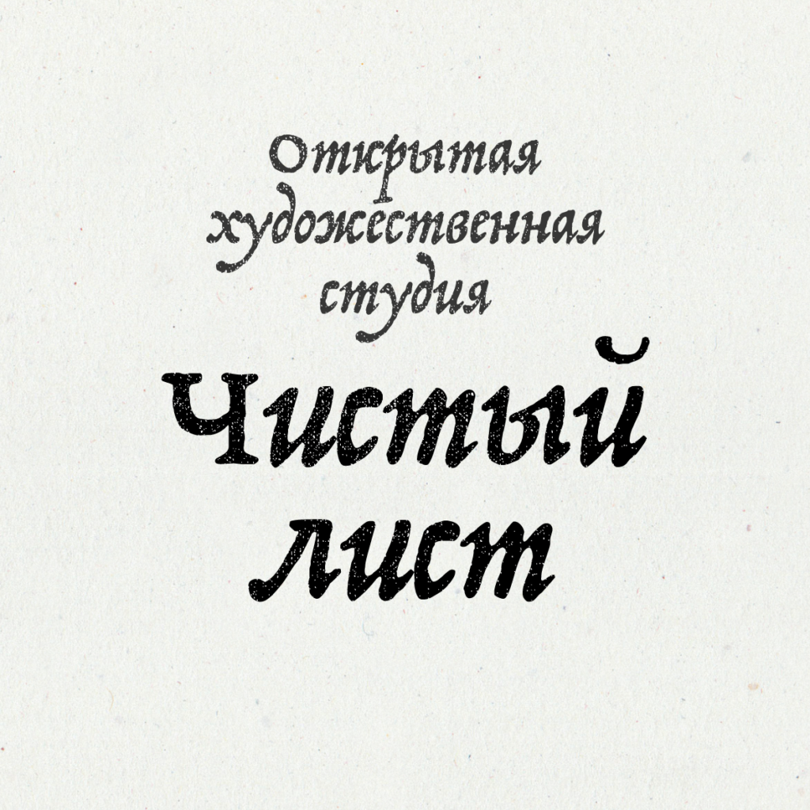

Базовый набор недорогих инструментов и материалов студия может закупать на добровольные пожертвования посетителей, а аренду и наполнение залов может восполнять в ходе выставок-продаж произведений резидентов и гостей студии.

Студия может стать локальным образовательным центром, способствовать практике и личностному росту художников, аккумулировать заказы и произведения на продажу, проводить презентации и выставки-продажи работ.
Оборудование студии:

- линейки,
- карандаши,
- кисточки,
- акварель,
- гуашь,
- акрил,
- ножницы,
- ножи,
- шпатели,
- емкости,
- палитры,
- столы и пюпитры,
- стулья и табуреты,
- столы для лепки,
- стеки…
