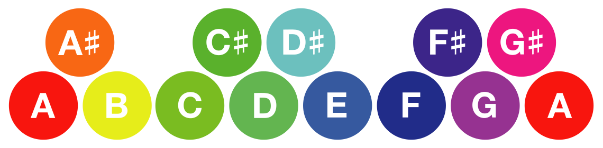

И звук и свет — волновые явления и у них очень много общего. И это не только физические свойства, но и их влияние на сознание людей. Приглушённые цвета, яркие нотки — ум человека собирает разрозненные сигналы чувств в единый образ. Это значит, что для нас цвет и звук связаны неразрывно всегда.

История знает множество подходов к темперации звукоряда. Современный равномерно темперированный строй делит весь спектр музыкальных звуков на 9 октав по 12 нот в каждой. Сопоставляя ноты октавы 12 основным цветам спектра света, мы обнаружили мостик между визуальной и аудиальной системами, позволяющий лучше разглядеть принципы музыкальной гармонии и созвучности цветов. 9 октав по 12 нот — 108 базовых частот, сочетая которые порождается бескрайнее музыкальное пространство.
