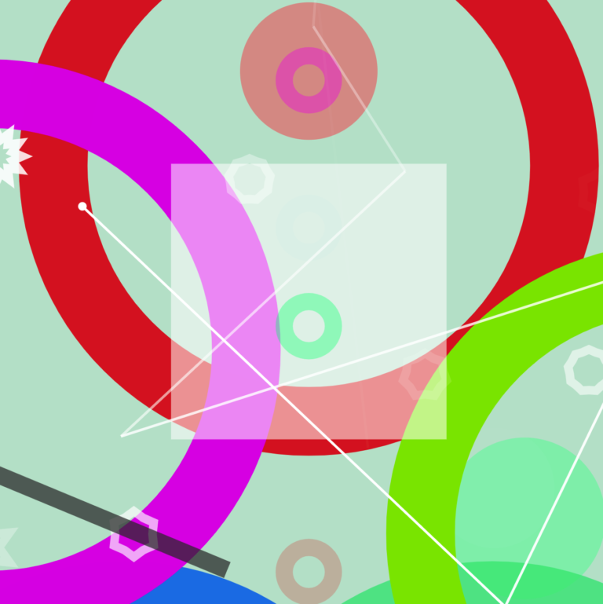

Настраиваемые взаимозаменяемые модули, содержащие в себе слои PaperJS, отображающие на виртуальном хосте визуальное представление входящего MIDI-сигнала

В проекте использованы:

- [VueJS](https://vuejs.org)
- [PaperJS](https://paperjs.org)
- [WebMIDI](https://djipco.github.io/webmidi/latest/classes/WebMidi.html)

Веб-приложение работает на десктопе в браузерах **Google Chrome**, **Safari**, на Андроиде — в **Chrome**, в iOS потребуется бесплатный [WebMIDI browser](https://apps.apple.com/us/app/web-midi-browser/id953846217)

В апреле 2021 года добавились эффекты и наборы пресетов.
