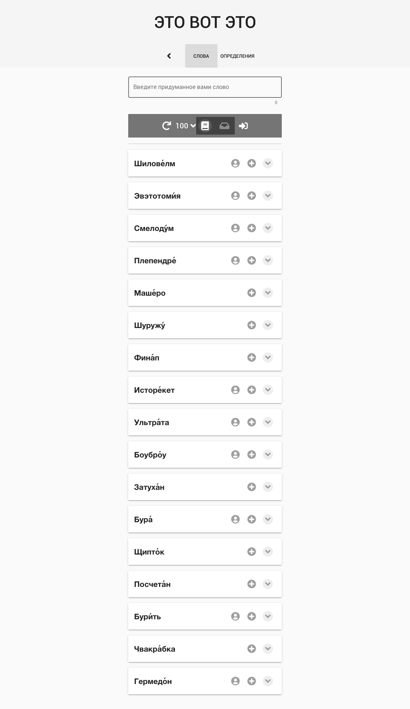

PHP платформа [Directus](https://directus.io/) позволяет легко создавать и управлять MySQL базами данных в удобном административном интерфейсе. Создаются и наполняются таблицы, устанавливаются связи между ними. Далее все это легко и приятно рулится через REST API из клиентского Vue приложения.

Приложение запрашивает список свежих слов с сервера и выводит карточками на экран. Есть возможность добавлять карточки, задавая ударение в словах.

Это вполне неплохое решение для несложных задач игры. Но я обнаружил прорывную GUN-db и столкнулся с проблемами в обновлении своего статического хостинга для соответствия новым версиям Directus. Мой хостер не спешит ставить MySQL с полной поддержкой UTF-8 и это не позволило мне плавно двигаться с прогрессом этой экосистемы. Тем не менее, это был классный опыт разработки связки с headless CMS.
