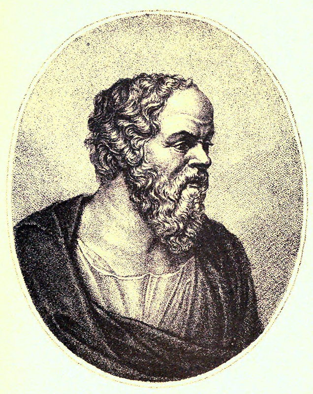

Журнал, освещающий свершения в мире искусства и повседневности с двух точек зрения – сформулированных мыслителями прошлого. Древнегреческий Сократ видел красоту в сообразности предмета его назначению, а живший на два тысячелетия позже Иммануил Кант считал, что прекрасное само по себе может быть целью для создания предмета для любования.

Все бумажные, PDF и Web-выпуски журнала делятся на две колонки, которые наполняются материалами, предложенными широким коллективом авторов. Каждый из них берет себе те или иные направления, темы, график публикаций в одной или обеих колонках.

Материалы могут выходить и лишь в одной колонке, но наиболее ценны - двухсторонние публикации, где предмет рассмотрен с обеих граней: как полезности, так и эстетичности. В публикацияъ осуществляется глубокий критический анализ как произведений современного искусства, так и продуктов современного производства. 

Такой журнал открывает дискуссию о прекрасном и вносит философский взгляд на явления окружающей действительности. 

  

## Кант

>- Прекрасное свободно от практического интереса
>- Прекрасное носит всеобщий характер и имеет значение для каждого
>- Красота есть форма целесообразности предмета, поскольку она востприниматеся в нем без представления о цели
>- Прекрасное есть то, что нравится без понятия, как предмет необходимый для любования

В колонке **Кант** публикуются материалы о высоко-эстетичных, но мало-практичных произведениях искусства и иных достижениях культуры.

## Сократ

> - Непохожее на прекрасное может быть прекрасным. На человека, прекрасного в беге, непохож другой, прекрасный в борьбе.
> - Щит, прекрасный для защиты, как нельзя более не похож на метательное копье, прекрасное для полета.
> - И навозная корзина — прекрасный предмет, и золотой щит — предмет безобразный. Первая для своего предназначения выполнена прекрасно, а второй — дурно.
> - То, что хорошо от голода, бывает дурно от лихорадки и наоборот.
> - Всё хорошо и прекрасно по отношению к тому, для чего оно хорошо приспособлено и, наоборот, дурно и безобразно по отношению к тому, для чего оно дурно приспособлено.

Колонка **Сократ** посвящена высоко полезным 

