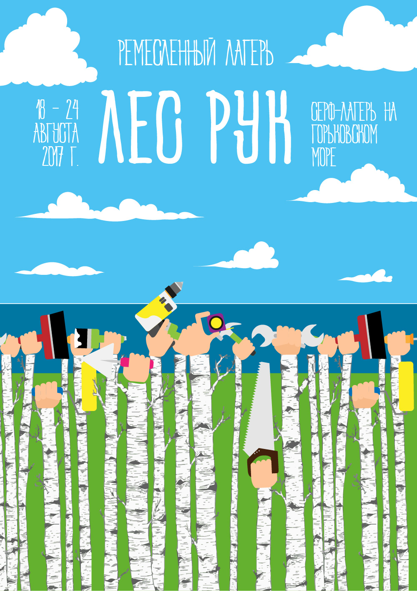

# Лес Рук

Мы выяснили, что открытая мастерская — это, в первую очередь, процесс, в котором люди, совместно используя доступные инструменты и материалы, самостоятельно учатся, исследуют и создают что-то новое. Для этого процесса, конечно, необходимо соответствующее пространство. Лучше всего для этого подходят специально подготовленные и оборудованные пространства, где есть все необходимые ресурсы и компетенции — общественные мастерские. Но чтобы начать что-то творить вместе, не обязательно ждать пока кто-то подготовит для этого пространство, ведь совместное увлечённое творчество само постепенно формирует общественную мастерскую вокруг себя. Главное — начать. И начинать можно с малого.

Лето. Лес, полянки, тропинки, побережье реки. Многие горожане стремятся побыть на природе. А некоторым хотелось бы там и остаться — так вдохновляют чистый воздух, тепло солнца, прохлада воды и природный ландшафт. Вдохновлённый человек способен творить прекрасные вещи любыми сподручными средствами. Рисунки на песке, конструкции из веток или камней, танцы у костра — это только отблеск невероятного потенциала человека, очищаемого пребыванием на природе от городской спешки и строгой самоидентификации.

Когда пребываешь вдали от города, его спешки и разнообразных сетей, начинаешь ценить то, что есть вокруг. Возьмёте с собой гитару и она озвучит вечера. Возьмёте краски и ими непременно что-нибудь нарисуют или раскрасят. Мотки ниток превратятся в сложные плетёные узоры, а с пилой, топором, молотком и гвоздями можно построить навес или целый дом. Люди своими силами могут вместе создавать летние лесные творческие поселения, объединяя усилия, материалы, инструменты и свободно делясь навыками и умениями.

Неизбежная задача воссоздания условий человеческого быта — первое дело, для которого нужны соответствующие инструменты. Лопата, топорик, пила. Зажигалка, нож, ложка, котелок. А ведь эти инструменты можно использовать и для творческого самовыражения. Да хотя бы вырезать фигурки из дерева или лепить их из обычной глины. Но на этом можно не останавливаться.

Представим себе место в лесу на побережье, где из года в год летом собираются множество самых разных людей. Кто-то поселился там насовсем, кто-то отдыхает или трудится там месяцами, но большинство приезжают лишь иногда по выходным или на тематические фестивали, собирающие людей из разных городов и стран мира.

Палатки, навесы, купола и деревянные дома. Туалеты, души, кухня и столовая. Сцены, пирсы, вышки, турники. И, конечно, целый склад использованных малярных, столярных и слесарных инструментов, а также всевозможных остатков материалов. Это уже немалый простор для творчества. Но можно на этом не останавливаться, ведь мы живём тогда, когда без особенных затрат можно воссоздать вокруг не просто комфортные условия лесного отдыха и быта, но и открыть полноценную универсальную мастерскую, создающую гармоничную среду для высвобождения фантазии и её творческих полётов вдохновлённых природой людей. Большой выбор эффективного ручного и аккумуляторного инструмента и множество средств связи и электрогенерации позволяют говорить о возможности высокой автономности таких удаленных от города созидательных пространств.

Но что делает мастерскую универсальной? Наиболее широкий спектр доступных творческих возможностей. Но как определять широту этого спектра? Мы нашли способ в общих чертах охватить, казалось бы, необъятные просторы всевозможных ремёсел, искусств и промыслов.

