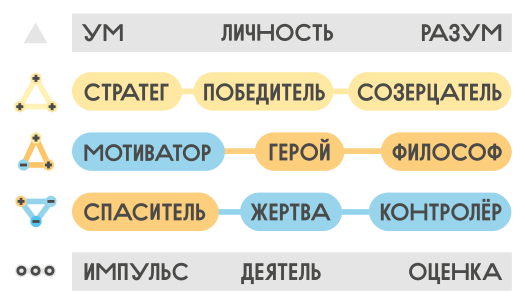

На основе наблюдений, описанных Эриком Берном и рядом других психотерапевтов в начале 1960-х годов был разработан новый инструмент изучения человеческой психики и работы с ней — транзакционный анализ. Это психологическая модель описания, анализа и трансформации поведения человека, включающая философию, теорию и методы, позволяющие людям понять самих себя и особенности своего взаимодействия с окружающими.

Читайте статью полностью на [psyfield.ru](https://psyfield.ru/synopsis/transact/)
