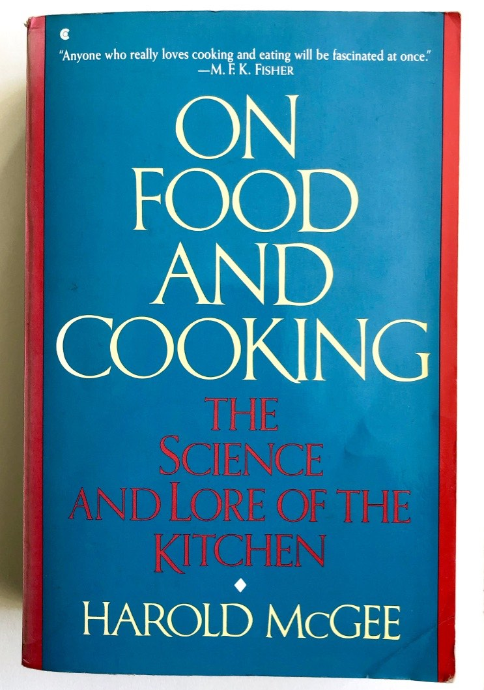

Объяснение проясняет, углубляет и расширяет понимание читателем предмета.

Оно не заботится о том, что пользователь может делать, как инструкции и руководства. Это не показ механики крупным планом, как в справочнике. Этот вид документации подходит к теме с более высокой перспективы и под другими углами.

Это позволяет объяснению стать **обсуждением** - более расслабленым и свободным способом рассмотрения чего-либо. Объяснение связывает вещи вместе. Это документация, которую имеет смысл читать когда не занимаешься непосредстенно самим продуктом.

---

## Ценность и место объяснений

> **Другие названия для объяснений**
>
> Не всегда очевидно, как лучше всего назвать вашу объяснительную документацию.
> Могут подойти следующие названия:
>
> - _Обсуждение_
> - _Бэкграунд_
> - _Концептуальные руководства_
> - _Предметная область_

### Объяснение и понимание

Объяснение в отличие от трех других форм документации не является прямой частью пользовательской практики или работы. Это значит, что иногда ее рассматривают как менее важную. Это – ошибка. Оно может быть менее **срочное**, чем три других, но никак не менее **важное**. Это - не роскошь. Ни один практик какого-либо ремесла не может позволить себе не иметь понимания этого ремесла и нуждается в пояснительных материалах, которые помогут связать все воедино.

В большинстве европейских языков слова, которые означают **понимание** имеют общий корень со словами, обозначающими "держать" или "хватать". Иметь возможность удерживать что-то или владеть чем-то – важная часть понимания. Оно склеивает воедино другие компоненты мастерства в ремесле и позволяет его уверенно присвоить.

Понимание не просто **приходит** из объяснения, но объяснение должно сформировать ту сеть, которая помогает удерживать все вместе. Без этого знание своего ремесла у практика будет ослаблено, фрагментировано и хрупко, а его применение – напряженно.

### Объяснение и его границы

Довольно редко можно увидеть объяснения выделенными в отдельную секцию в документации, а сама идея, что вещи нуждаются в объяснении часто выражено лишь поверхностно. Вместо этого объяснения чаще всего рассыпаны маленькими порциями в других разделах.

Не всегда просто написать хороший объяснительный материал. С чего начать? Также не очень понятно, где закончить. В этом есть некоторая неопределенность, которая может дать автору слишком много возможных вариантов.

Инструкции, руководства и справочники четко определены в своей сфере задач чем-то, что можно точно определить: тем, что пользователь должен узнать, какую задачу пользователь пытается решить, или просто фокусом на самом механизме.

В случае объяснения полезно иметь реальные или выдуманные вопросы **"почему?"**, которые будут служить точкой входа. В противном случае вам нужно просто очертить какую-то линию, обозначив разумную область и этим удовлетвориться.

---

## Аналогия с приготовлением пищи

В 1984 году Гарольд МакГи опубликовал книгу **"О еде и ее приготовлении"**.

Эта книга не учит как что-либо приготовить. Она не содержит рецептов (кроме исторических примеров) и она не работает как справочный материал. Вместо этого она помещает еду и готовку в контекст истории, общества, науки и технологии. Она объясняет, например, почему мы делаем то, что мы делаем на кухне и как это менялось во времени.

Она рассматривает свой предмет с множества различных перспектив, используя их чтобы осветить его с разных сторон.

После чтения книги вроде **"О еде и ее приготовлении"**, наше понимание меняется. Наше знание становится богаче и глубже. Мы можем ничего не узнать такого, что можно применить на практике или что изменит то, что мы делаем, однако **она поменяет то, как мы думаем о своем ремесле**, а это не менее важно.

Это что-то, что мы можем читать в свободное время, вдали от кухни, когда мы хотим подумать про готовку на более высоком уровне, чтобы понять больше о самом предмете.

---

## Написание хороших объяснений

> **Что стоит обсудить**
>
> - более широкая картина
> - история
> - выбор, альтернативы, возможности
> - почему: причины и оправдания

### Создавайте связи

Во время написания объяснений вы помогаете переплетать сеть понимания в головах ваших читателей. **Создавате связи** с другими вещами, даже с теми, что находятся вне вашего непосредственного предмета, если это может помочь.

### Предоставьте контекст

**Предоставьте обстоятельсва и контекст в ваших объяснениях**: расскажите _почему_
вещи таковы – дизайн-решения, исторические причины, технические ограничения – обозначьте подтексты, упомяните конкретные примеры.

### Говорите **о** предмете

Объясненительные материалы говорят **о** предмете в том смысле, что они располагаются как бы **вокруг** него. Даже названия таких материалов должны отражать это. У вас должна быть возможность поставить перед каждым из заголовков подразумеваемое (или реальное) слово **"О"**. Например, **"Об авторизации пользователей"**, или **"О политиках подключения к базе данных"**

### Обсуждайте альтернативы и различные мнения

**Объяснения могут рассматривать альтернативы**, контр-примеры и множество разных подходов к одному и тому же вопросу. Вы не даете инструкции и не описываете факты – вы раскрываете предмет для обсуждения. Это помогает думать об объяснении как о дискуссии: обсуждаения могут рассматривать и взвешивать даже противоположные **мнения**.

### Не инструктируйте и не предоставляйте техническую справку

Один из рисков объяснений – это то, что другие вещи могут закрастся в них. **Объяснения должны делать то, чего не делают другие части документации.** Объяснения – не место для инструктирования пользователя как что-то сделать. И не должны они давать технические описания. Об этих функциях документации позаботятся другие разделы.

---

## Язык объяснений

_Причина Х в том, что исторически У..._
: Объясняйте.

_А лучше Б потому что..._
: Представляйте суждения и даже мнения там, где это уместно.

_Х в системе А аналогичен У в системе Б. Однако..._
: Предоставьте контекст, который поможет читателю.

_Некоторые пользователи предпочитают В (потому что Г). Это может быть неплохим подходом, но..._
: Взвешивайте альтернативы.

_Д взаимодествует с Е в следующем порядке..._
: Раскройте внутренние секреты механизмов, чтобы помочь понять, почему что-то делает то, что делает.
