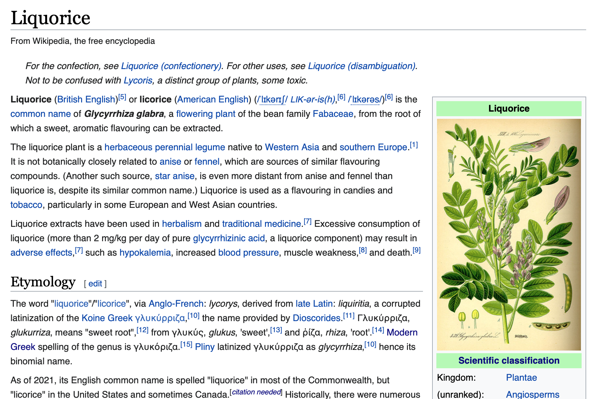

Единственное назначение справочника – описать, насколько возможно лаконично и упорядоченно. В то время как содержание руководств и инструкций следуют за потребностями пользователя, справочник следует за продуктом, который он описывает.

В случае программ, справочник описывает программу как таковую: API, классы, функции и т.д., а также как их использовать.

Пользователям нужны справочные материалы потому что им нужна правда и уверенность – твердые основания на которые можно опереться в работе. Хорошая техническая документация насущно необходима чтобы дать пользователям уверенность в их работе.

---

## Справочник как объяснение

Справочные материалы должны быть **суровы и по делу**. Редко кто-то _читает_ справочник, чаще мы _консультируемся_ с ним.

В справочнике не должно быть сомнений и неоднозначности. Он должен быть абсолютно авторитетен.

Справочник как карта. Карта говорит вам что вам нужно знать про территорию без необходимости пойти и проверить эту территорию самому. Справочные материалы служать той же самой цели для продукта, что и его внутренняя машинерия.

Хотя справочник не должен пытаться показать как выполнять то или иное действие, он может и часто должен включать описание того как что-то работает или как это правильно использовать.

Некоторые справочные материалы (такие как документация API) могут быть сгенерированы автоматически программой, которую они описывают – это мощный способ убедиться что они продолжают точно соответсвовать коду. К несчастью, в мире слишком много разработчиков программ, которые думают6 что это и есть вся необходимая документация.

---

## Пища и её приготовление

Возможно вы можете свериться с энциклопедией, чтобы прочитать про ингредиент (к примеру – лакрица).

То, что вы ищете – информация – точная, современная, всеохватная информация. Вы можете захотеть узнать о его свойствах, химическом составе, о том, как он взаимодействует с другими интредиентами, с какими ингредиентами или растениями он связан, какие могут быть последствия его употребления на здоровье.

Например: «Лакрица - это цветковое растение семейства бобовых Fabaceae», или «Чрезмерное употребление лакрицы может привести к неблагоприятным последствиям».

Вы будете ожидать найти информацию обо всех этих гранях представленных в похожей для каждого форме.

С другой стороны вы не ожидаете найти, например, рецепты или предложения о том, как готовить с ней – говорить вам что делать – не входит в задачи энциклопедической статьи.

---

## Написание хорошего справочника

> **Стиль и форма**
>
> - сурово и бескомпромиссно
> - нейтральность, объективность, факты
> - структурированность в соответствии со структурой самой описываемой системы

### Уважайте структуру системы

То, как карта соответсвует территории, которую она описывает, помогает нам использовать первую, чтобы находить дорогу через последнюю. С документацией должно быть точно также: **структурая документации должна отображать структуру продукта**, чтобы пользователь мог прокладывать свой путь через них одновременно.

В случае с кодом, это означает что расположение секций справочных материалов, где это возможно, следует архитектуре самой программы

Это не означает превратить документацию в неестественную структуру. Что важно – это логическое, концептуальное расположение и связи внутри кода должны помогать понять документацию.

### Будьте последовательны

**Справочные материалы выигрывают от последовательности**. Постоянство важно в структуре, языке, терминологии, тоне. В писательстве есть масса возможностей порадовать ваших читателей богатым словарем и владением множеством стилей, но справочник – то точно не одна из них.

### Ничего кроме объяснений

**У технической справки одна задача – описывать.** И делать это ясно, точно и всесторонне. Делать что-то ещё: объяснять, обсуждать, инструктировать, размышлять – все это будет помехами для этой задачи и сделает для читателя поиск необходимой информации труднее.

Может быть соблазнительно добавить инструкцию или объяснение, просто потому что техническая справка может показаться слишком голой. Вместо этого по мере необходимости давайте ссылки на инструкции, объяснения и вводные руководства.

### Предоставьте примеры

**Примеры** – это важные способы предоставить иллюстрации, которые помогают читателям понять справку, не отвлекаясь при этом от задачи описания. Например, пример использования команды может быть лаконичным способом проиллюстрировать её и её контекст.

### Будьте точны

**Эти описания должны быть точны и актуальны.** Любые несоотвествия между системой и её описанием будут неизбежно вводить пользователя в заблуждение.

---

## Язык справочных материалов

**А - это пример Б. В необходимо инициализировать с помощью Г. Эта опция делает это.** - Утверждайте факты о системе и её поведении

**Подкомандами являются: а,б,в,г,д,е.** - Перечисляйте команды, опции, операции, возможности, флаги, ограничения, сообщения об ошибках и т.д.

**Вам нужно использовать А. Н применяйте Б пока не С. Никогда не делайте D.** - При необходимости – предупреждайте.
