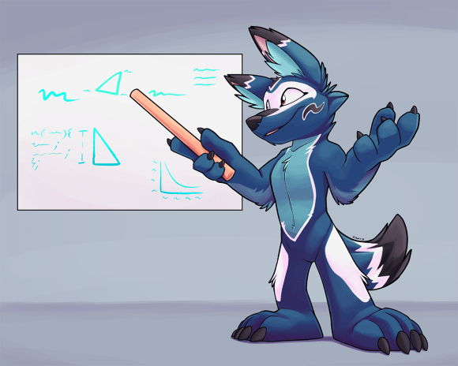

[soatok.blog](https://soatok.blog/2021/10/19/against-web3-and-faux-decentralization/)     

Криптовалютные аферы бывают разных форм и размеров.   
У вас есть мошеннические схемы «раздача Илона Маска» со взломанных аккаунтов в Твиттере. У вас есть люди, которые поджидают вас на торговых платформах (например, LocalBitcoins) для торговли со взломанного финансового счета (который
затем выставит против вас возврат, если вы попадетесь на это). У вас есть [все повальное увлечение NFT](https://soatok-blog.translate.goog/2021/10/01/furry-porn-against-nfts-a-call-to-forearms/?_x_tr_sl=auto&_x_tr_tl=ru&_x_tr_hl=ru&_x_tr_pto=wapp) и все его уродливые итерации. У вас есть сумрачные рынки даркнета, криптовалютные «тумблеры» и программы-вымогатели.   
Но прикрывающая все эти очевидные мошенничества, методы отмывания денег и откровенную преступной деятельности, направленной против невинных людей, сфабрикованная шумиха вокруг криптовалюты просто оглушительна.   

Иногда буквально; как с парнем BitConnect.   

[Bitconnect: The Wannabe Bitcoin Ponzi Scheme \| Multi Level Mondays](https://www.youtube.com/watch?v=fw_xe3xnzGc)    

Когда субреддит WallStreetBets побудил [тысячи розничных инвесторов инвестировать в GameStop, чтобы похлопать в ответ хедж-фондам, которые переусердствовали с их короткими продажами](https://translate.google.com/website?sl=auto&tl=ru&hl=ru&client=webapp&u=https://en.wikipedia.org/wiki/GameStop_short_squeeze) , вокруг термина DeFi было много шума. (Сокращение от «Децентрализованные финансы», если вам интересно.)   

Но DeFi не был достаточно амбициозным для этих шумихи. В
последние несколько недель они астротурфировали социальные сети, чтобы
создать достаточно шума и поддержки для идеи, о которой CloudFlare даже
написала в блоге: [Web3, децентрализованная сеть](https://translate.google.com/website?sl=auto&tl=ru&hl=ru&client=webapp&u=https://blog.cloudflare.com/what-is-web3/) .   

> Я не знаю, с помощью каких инструментов будет строиться Web III, но Web IV будет строиться из палок и камней.   
> (с извинениями за цитату, бездоказательно приписываемую Альберту Эйнштейну)   

Итак, давайте поговорим о Web3, о том, почему он потерпит неудачу и что мы, как индустрия, могли бы сделать лучше, чтобы решить проблемы, которые Web3 *обещает* решить, даже не накачивая [криптовалюту](https://soatok-blog.translate.goog/2021/04/19/a-furrys-guide-to-cryptocurrency/?_x_tr_sl=auto&_x_tr_tl=ru&_x_tr_hl=ru&_x_tr_pto=wapp).   
   
    

## Что утверждает о себе Web3?   
Web3 претендует на звание «децентрализованного Интернета», в котором
личность пользователя поддерживается токеном в блокчейне криптовалюты и
полагается на криптографические доказательства, а не на доверенную
третью сторону для сопоставления личности с людьми.   

В частности, Web3 использует NFT как своего рода децентрализованную идентичность. (Если вы еще не читали его, см. мой предыдущий пост [о NFT](https://soatok-blog.translate.goog/2021/10/01/furry-porn-against-nfts-a-call-to-forearms/?_x_tr_sl=auto&_x_tr_tl=ru&_x_tr_hl=ru&_x_tr_pto=wapp) .)   

Это принципиально ошибочная идея, но ее компоненты имеют *некоторые* достоинства, как я объясню подробно.   

На мой взгляд, основными недостатками Web3 являются:   
1. Web3 — это фальшивая децентрализация
2. Децентрализованная идентификация не требует криптовалюты
   
   
## Web3 — это фальшивая децентрализация  

Web3 — это фальшивая децентрализация, потому что криптовалюта — это фальшивая децентрализация.   

Если вы мне не верите, давайте посмотрим на некоторые конкретные и известные примеры двух самых популярных криптовалютных проектов ( [по рыночной капитализации](https://translate.google.com/website?sl=auto&tl=ru&hl=ru&client=webapp&u=https://web.archive.org/web/20211019042533/https://coinmarketcap.com/) ), которые являются децентрализованными».   

- **Биткойн**: до того, как китайское правительство запретило добычу биткойнов в начале этого года, на их долю приходилось [до 67% от общего хэшрейта биткойнов](https://translate.google.com/website?sl=auto&tl=ru&hl=ru&client=webapp&u=https://archive.md/JaJoS). После запрета биткойнов в Китае [США быстро выросли до 35% хешрейта биткойнов](https://translate.google.com/website?sl=auto&tl=ru&hl=ru&client=webapp&u=https://web.archive.org/web/20211019042209/https://www.yahoo.com/now/us-overtakes-china-world-largest-173900029.html?guccounter=1) . Помните: вам нужно контролировать [чуть более 50% хешрейта](https://translate.google.com/website?sl=auto&tl=ru&hl=ru&client=webapp&u=https://www.investopedia.com/terms/1/51-attack.asp) , чтобы контролировать всю сеть.   
  
- **Эфириум**: Когда DAO (организация, основанная на смарт-контрактах) была успешно атакована, они [организовали хард-форк, чтобы компенсировать ущерб](https://translate.google.com/website?sl=auto&tl=ru&hl=ru&client=webapp&u=https://ethereum.org/en/history/#dao-fork) .   
-    
    > Разработчики Ethereum утверждают, что это решение было основано на отзывах майнеров Ethereum, представляющих 85% участвующих адресов Ethereum. Однако стоит отметить, что из-за транзакционных издержек, присущих криптовалютным транзакциям (которые лежали в основе их избрания),   
    > богатые пользователи Ethereum могли бы проголосовать «за» со многих адресов, в то время как средний небогатый пользователь был бы менее   
    > способен на это. Не говоря уже о риске схем покупки голосов «Dark DAO» .   

- **Бонусный раунд — Bitcoin SV**: Bitcoin SV — это форк Bitcoin Cash, который является форком Bitcoin, который [ранее в этом году успешно подвергся атаке 51%](https://translate.google.com/website?sl=auto&tl=ru&hl=ru&client=webapp&u=https://archive.md/suKJ4) . Упс.   
   
В лучшем случае криптовалюта создает иллюзию децентрализации. Вы
можете применить Теорию игр к стимулам майнеров и разработчиков для
поддержания этой иллюзии, если вам это нравится, но во-вторых, все
находятся под давлением (например, атака DAO угрожала прибыли
инвесторов-китов, если цена ETH упала), маска оторвется, и вы
столкнетесь с централизацией прямо в лицо.   

> NFT-олигархия? Исследование 6,1 млн сделок NFT показало, что несколько человек находятся в центре рынка   
> На 10% ведущих трейдеров приходится 85% транзакций, и они торгуют хотя бы один раз 97% всех активов   
> 10% пар покупателей и продавцов имеют одинаковый объем как остальные 90% https://t.co/V3vytqZZB5 pic.twitter.com/IDr67zl7TI   

— Итан Моллик (@emollick) [30 ноября 2021 г.](https://translate.google.com/website?sl=auto&tl=ru&hl=ru&client=webapp&u=https://twitter.com/emollick/status/1465505077083389960?ref_src=twsrc%5Etfw)   

PDF в архиве [здесь](https://translate.google.com/website?sl=auto&tl=ru&hl=ru&client=webapp&u=https://web.archive.org/web/20211201081218/https://www.nature.com/articles/s41598-021-00053-8.pdf?error=cookies_not_supported&code=0b07cd61-0b2a-4ea2-b013-3ff10a4ec7af)   

По своей сути криптовалюта является или становится централизованной по простой экономической причине: **капитализм**.   
   
    
   
### Централизация неизбежна при капитализме   

В Соединенных Штатах нас часто учат широко разоблаченной экономической теории «просачивания вниз». Вместо **жидкости** под действием гравитации лучше моделировать богатство как **саму гравитацию**: чем больше у вас есть, тем легче становится притягивать к себе больше.  

Если вы возьмете несколько эгалитарный (во всяком случае, с оптимистической точки зрения) подход к децентрализации и сопоставите его с ранее существовавшими экономическими условиями каждого, вы в конечном итоге примените [функцию идентичности](https://translate.google.com/website?sl=auto&tl=ru&hl=ru&client=webapp&u=https://en.wikipedia.org/wiki/Identity_function) к уже существующей системе.   
То есть: **централизация внутрь, централизация вовне**.   

    
 
Состоятельные люди могут позволить себе больше компьютерного оборудования, чем вы, и они могут нанять людей для решения сложных технических проблем, в которых они не разбираются. У нас с вами нет этого капитала, и поэтому мы в невыгодном положении.  

Централизация — неизбежный результат капитализма или любой системы, построенной на основе капитализма. Любите вы или ненавидите капитализм, это системная неизбежность.   
   
### Как децентрализовать?   

Принять децентрализацию — значит отказаться от сетевых эффектов. Децентрализация должна охватывать анонимность и свободу информации. Хакерский дух. Манифест шифропанка. Децентрализация означает отказ от правителей — будь то политических или финансовых.   

Настоящая децентрализация требует соблюдения принципов криптоанархистов, что требует анархистской цифровой валюты; *не анархо-капиталистический* . Капитализм создает иерархию, которая создает правителей, что несовместимо с анархией.

Без гравитационных эффектов капитала, определяющих неравенство в доходах и богатстве, мы могли бы разработать криптовалюту, которая была бы фактически децентрализованной, даже если миром в значительной степени управляют капиталистические экономические системы.   
   
### На пути к децентрализованной цифровой валюте без капитализма

Как бы выглядела децентрализованная цифровая валюта без капитализма? Трудно сказать, потому что, насколько мне удалось выяснить, такие конструкции никогда не предлагались.   

В отсутствие капитализма нам понадобится альтернативная экономическая
система, на основе которой будет построен дизайн, и принципы которой нам нужно будет внедрить.   

Как неспециалист, я знаю, что единственными альтернативными экономическими системами являются социализм, коммунизм и эгалитаризм. Для целей этого мысленного эксперимента вы можете рассматривать любую
экономическую систему без правителя как взаимозаменяемую, хотя детали,
безусловно, будут иметь значение для любой реальной реализации.   
**Важно**: я не заинтересован в обсуждении политики экономических систем. Это неформальное академическое упражнение по моделированию того, как будет выглядеть децентрализованная цифровая валюта, если убрать капитализм из ее ядра. Устранение капитализма помогло бы предотвратить долгосрочную централизацию цифровой валюты, поэтому я думаю, что эту тему стоит изучить, даже если вы не любите некапиталистическую экономику или поддерживаете свободный рынок. Я здесь не для того, чтобы судить, так что давайте немного остынем и включим наше воображение.   
   
    
   
### Требования к некапиталистической цифровой валюте   

Во-первых, он обязательно будет распределен и разделен, как [Stellar](https://translate.google.com/website?sl=auto&tl=ru&hl=ru&client=webapp&u=https://www.stellar.org/), чтобы облегчить децентрализованную торговлю между независимыми коммунами (которые будут иметь отношения «многие ко многим» с людьми).   

Кроме того, каждая коммуна будет определять свою собственную местную валюту независимо от глобального состояния сети. Обмен будет осуществляться между общинами, а не отдельными лицами. Однако внутри сообщества они смогут пределять свои собственные правила участия отдельных лиц в торговле между сообществами. Скорее всего, это будет реализовано с помощью своего рода смарт-контракта.   

В коммуне все токены будут иметь срок действия (например, высоту блока) с момента их добычи. По истечении срока действия жетоны будут переработаны путем равномерного распределения их стоимости между всеми членами коммуны — в качестве своего рода универсального базового дохода. Это создало бы неизбежный налог на богатство, от которого богатые не смогли бы уклониться, не требуя механизма ценовой инфляции, используемого сегодня в нецифровых валютах.   

Частные транзакции, такие как реализованные в ZCash, будут включены по умолчанию. Это необходимо для сохранения личной конфиденциальности. По умолчанию в открытом виде будут отправляться только обмены между коммунами.   

Целостность глобального состояния между коммунами должна поддерживаться с помощью нерасточительного алгоритма консенсуса; например, Proof-of-Stake. С этой целью коммуны смогут делать ставки на некоторые из своих коллективных активов (вознаграждаются и, при необходимости, обмениваются между коммунами, участвующими в добыче полезных ископаемых), для авторизации транзакций и разрешения споров. Глобальные токены без стейкинга истекают так же, как и общие токены, но стейкинг продлевает срок действия токена.   

Каждая коммуна сможет определить свой собственный внутренний протокол
консенсуса, но расточительные протоколы (например, Proof-of-Work)
настоятельно не рекомендуются. Если используется Proof-of-Stake, коммуны могут решить, продлевается ли их общая валюта для поставленных токенов.   

Определенный для коммуны процент (который ДОЛЖЕН БЫТЬ не менее 50%, вплоть до 100%) всех входящих активов истекает и выплачивается немедленно, гарантируя, что сообщество всегда получает выгоду от торговли, а класс богатой знати не появляется из-за уклонения от уплаты налогов.

Возможно, есть много других соображений, в которые я еще не вникал. Я не экономист; просто инженер по безопасности, специализирующийся на криптографии. Считайте это черновиком, пока кто-нибудь поумнее не проверит его.   

Короче говоря, если вы хотите **настоящей децентрализации**, вам отсюда не добраться ни с какой капиталистической криптовалютой (которая, к сожалению для Web3, описывает все существующие криптовалюты). Однако, выбрав несколько конкретных вариантов дизайна, вы можете создать криптовалюту, которая моделирует некапиталистическую экономическую систему.   
   
    
   
## Децентрализованная идентификация не требует криптовалюты   
Независимо от того, есть ли у вас истинная децентрализация в вашем любимом блокчейн-проекте, оказывается, вам вообще не нужна цифровая валюта для реализации чего-то вроде NFT.   

Вы можете заменить NFT и схемы MLM, поддерживаемые NFT, комбинацией следующих компонентов:   

1. Какой-то **журнал прозрачности** , такой как [Trillian](https://translate.google.com/website?sl=auto&tl=ru&hl=ru&client=webapp&u=https://github.com/google/trillian) (который лежит в основе [прозрачности сертификата](https://translate.google.com/website?sl=auto&tl=ru&hl=ru&client=webapp&u=https://certificate.transparency.dev/) ).   
    - Большинство (если не все) криптовалюты квалифицируются как журнал прозрачности, но его существование не делает автоматически более крупную систему «блокчейном».   
2. Мета-протокол, как [Gossamer](https://translate.google.com/website?sl=auto&tl=ru&hl=ru&client=webapp&u=https://gossamer.tools) , но для связывания открытых ключей с идентификацией и управления изменяемым владением активами.   
   
Все, что вам нужно, — это неразрывная цепочка ответственности между
художником, создавшим произведение, и текущим владельцем произведения,
чтобы доказать право собственности.  

Примечание. Наличие сторонних аттестаций личности художников для данного открытого ключа также необходимо для предотвращения того, чтобы какой-то случайный чувак притворялся художником, а затем чеканил NFT для работ, которые они не создавали.   

Вам не нужна криптовалюта для выполнения функции, подобной NFT. Но, само собой разумеется, такая система элегантно вписалась бы в некапиталистическую цифровую валюту, которую я предложил в предыдущем разделе.   
   
    
  
## Заключительные мысли   

Web3 может быть просто следующей итерацией в бесконечной череде тупых модных словечек, используемых торговцами криптовалютой, но понятие, которое он описывает, действительно заключает в себе некоторые идеи, которые могут быть ценными.   

Однако эти идеи не очень хорошо работают с существующими проектами
криптовалюты и часто даже не требуют фактической криптовалюты, чтобы
быть успешными.   

Кроме того, бросьте эту чушь Web3 и чушь Web2.0, которая ей предшествовала, если уж на то пошло. Верните независимые блоги и личные веб-сайты.   
   
